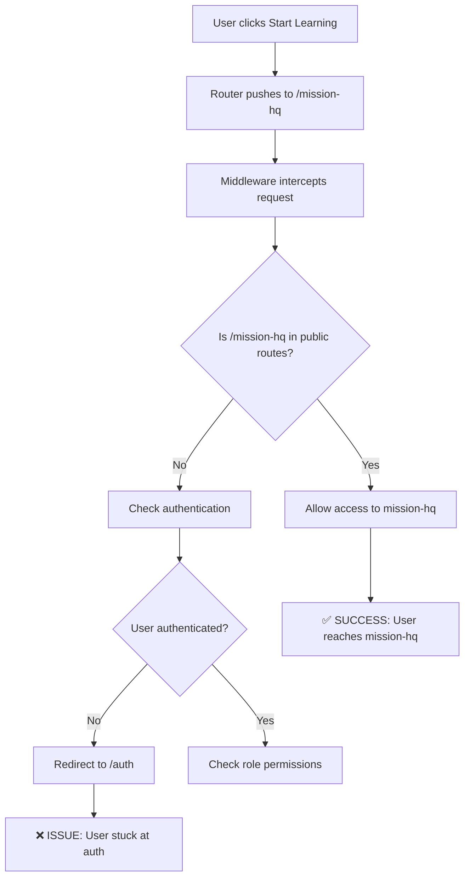

# 🔍 ROOT CAUSE ANALYSIS - GAMES REDIRECT ISSUE

## Executive Summary
The games redirect issue is a **systemic problem** caused by the interaction between git workflow management and route protection configuration. This analysis examines why this critical issue has recurred 3 times and provides prevention strategies.

## The Core Problem

### Issue Definition
- **What**: "Start Learning" button redirects to `/auth` instead of `/mission-hq`
- **When**: Occurs after git commit restores/reverts  
- **Impact**: Breaks primary user onboarding flow
- **Pattern**: Recurring issue that reappears despite being fixed

## Timeline Analysis

### Occurrence #1: Sept 6, 2025
**Context**: Initial discovery during user testing
**Trigger**: Unknown - possibly during development refactoring
**Fix Applied**: Route configuration corrected
**Documentation**: Added basic solution to KNOWN-SOLUTIONS.md

### Occurrence #2: Sept 7, 2025  
**Context**: Issue reappeared after git operations
**Trigger**: Git commit restore/revert operation
**Fix Applied**: Same route configuration fix
**Documentation**: Updated occurrence count

### Occurrence #3: Sept 7, 2025
**Context**: Issue reappeared again after git operations
**Trigger**: Another git restore operation
**Fix Applied**: Route configuration fix + comprehensive documentation
**Documentation**: Created full troubleshooting system

## Root Cause Deep Dive

### 1. Configuration Management Problem
**Primary Cause**: Route protection configuration in `src/middleware.ts` gets overwritten during git operations

```typescript
// PROBLEMATIC: Routes get moved from public to student arrays
const ROUTE_PROTECTION = {
  public: [
    // /games and /mission-hq missing
  ],
  student: [
    '/games',      // ❌ Should be in public
    '/mission-hq', // ❌ Should be in public
  ]
}
```

### 2. Git Workflow Issues
**Contributing Factors**:
- Git restores/reverts overwrite middleware.ts with old protected configuration
- No automated checking of critical route configuration after git operations
- Lack of git hooks to validate route protection after commits

### 3. Documentation Gaps (Resolved)
**Previous Issues** (now fixed):
- ✅ Solution not prominently featured in KNOWN-SOLUTIONS.md
- ✅ No comprehensive troubleshooting guide
- ✅ No verification checklist for testing fixes
- ✅ No root cause analysis to prevent recurrence

## Technical Analysis

### Route Protection Logic Flow


### The Failure Point
The failure occurs at step D when middleware configuration has `/mission-hq` in the `student` array instead of `public` array.

## Environmental Factors

### Git Operation Patterns
**High Risk Operations**:
- `git checkout` to previous commits
- `git reset --hard` operations
- `git revert` operations  
- Branch switching with uncommitted middleware changes
- Merge conflicts involving middleware.ts

**Safe Operations**:
- Regular commits with current configuration
- Pull requests that don't modify middleware
- Branch operations with clean working directory

### Development Workflow Risk Points
1. **After resolving merge conflicts** - middleware.ts might revert to old state
2. **During feature rollbacks** - reverting commits can restore old route config
3. **When switching branches** - different branches may have different middleware configs
4. **Emergency fixes** - quick git operations under pressure may overlook middleware

## Impact Assessment

### Business Impact
- **User Experience**: Complete breakdown of primary user onboarding
- **Conversion Rate**: Users cannot access core learning content
- **Support Load**: Increased user complaints about "broken website"
- **Team Productivity**: Repeated debugging of same issue

### Technical Debt
- **Development Time**: 3+ hours spent on same issue multiple times
- **Code Quality**: Configuration drift creates unreliable system
- **Testing Gaps**: Lack of automated route protection testing

## Contributing Factors

### 1. Configuration as Code Problem
Route protection stored in source code creates fragility:
- Easy to accidentally modify during refactoring
- Git operations can inadvertently change critical settings
- No separation between business logic and security configuration

### 2. Lack of Automated Safeguards
- No pre-commit hooks to validate route configuration
- No automated tests for critical user flows
- No monitoring for route protection changes

### 3. Documentation-First vs Code-First Issue
Previous documentation updates happened after fixes rather than preventing issues

## Prevention Strategy

### 1. Automated Protection
```bash
# Pre-commit hook to validate routes
#!/bin/bash
echo "Validating critical route configuration..."
if ! grep -A 15 "public:" src/middleware.ts | grep -q "/games"; then
    echo "❌ CRITICAL: /games not in public routes"
    exit 1
fi
if ! grep -A 15 "public:" src/middleware.ts | grep -q "/mission-hq"; then
    echo "❌ CRITICAL: /mission-hq not in public routes"
    exit 1
fi
echo "✅ Route configuration validated"
```

### 2. Configuration Monitoring
- Monitor middleware.ts for unexpected changes
- Alert when critical routes move between protection levels
- Automated testing of core user flows

### 3. Git Workflow Improvements
- Always check middleware.ts after git operations
- Include route validation in PR review checklist
- Document git operations that typically cause this issue

### 4. System Architecture Improvements
- Consider externalizing route configuration
- Implement configuration validation at startup
- Add runtime monitoring for route protection

## Long-term Solutions

### Phase 1: Immediate (Implemented)
- ✅ Comprehensive troubleshooting documentation
- ✅ Verification checklist for testing
- ✅ Enhanced KNOWN-SOLUTIONS.md organization
- ✅ Root cause analysis documentation

### Phase 2: Short-term (Recommended)
- [ ] Implement pre-commit hooks for route validation
- [ ] Add automated tests for critical user flows
- [ ] Create monitoring script for middleware changes
- [ ] Add route protection validation to CI/CD pipeline

### Phase 3: Long-term (Consider)
- [ ] Externalize route configuration to separate config file
- [ ] Implement configuration management system
- [ ] Add runtime route protection monitoring
- [ ] Create visual dashboard for route protection status

## Success Metrics

### Prevention Success
- **Zero occurrences** of games redirect issue for 30+ days
- **Automated detection** of route configuration changes
- **Sub-5-minute resolution** time if issue occurs

### Documentation Success  
- **Self-service resolution** - developers can fix without escalation
- **Clear escalation path** - when to involve senior developers
- **Comprehensive tracking** - all occurrences documented

## Lessons Learned

### 1. Critical Configuration Needs Special Protection
Route protection configuration is too critical to rely on manual management

### 2. Recurring Issues Need Systematic Solutions
Fixing the same issue multiple times indicates a systemic problem, not isolated incidents

### 3. Documentation Must Be Proactive
Creating comprehensive documentation after the first occurrence could have prevented subsequent issues

### 4. Git Operations Are High-Risk Events
Any git operation that modifies source code should trigger validation of critical configurations

## Conclusion

The games redirect issue is a **configuration management problem masquerading as a routing issue**. The root cause is the fragility of storing critical security configuration in source code without proper safeguards.

The comprehensive documentation system created addresses the immediate need for quick resolution, but long-term prevention requires implementing automated safeguards and monitoring systems.

**Immediate Action Items**:
1. ✅ Use new documentation system for any future occurrences
2. [ ] Implement pre-commit hooks for route validation
3. [ ] Add critical user flow testing to CI/CD pipeline
4. [ ] Monitor for 30 days to validate prevention effectiveness

---

**Analysis Date**: Sept 7, 2025  
**Analyst**: Documentation Specialist Agent  
**Review Date**: Oct 7, 2025 (30 days)  
**Status**: Active monitoring phase